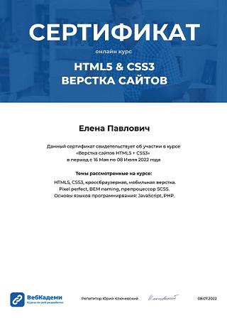

# Elena Pavlovich

#### Junior Frontend Developer
***
#### Contact information:
+ **Location:** Minsk, Belarus
+ **Phone:** +375298301280
+ **E-mail:** elena-pavlovichh@mail.ru
+ **Telegram:** @lena_pavlovich
+ **Linkedin:** [Elena Pavlovich](https://www.linkedin.com/in/elena-pavlovich-0a3491232/)
+ **GitGub:** [Elena-web](https://github.com/Elena-web)

_	_	_
#### About Me:
I am an enthusiastic, self-motivated, reliable, responsible and hard working person. 
I am a mature team worker and adaptable to all challenging situations. 
I am able to work well both in a team environment as well as using own initiative. 
I am able to work well under pressure and adhere to strict deadlines.

***
#### Skills and Proficiency:
+ HTML5, CSS3, Sass
+ BEM
+ JavaScript Basics
+ Git
+ PHP
+ VS Code
+ Adobe Photoshop, Figma
+ Pixel Perfect
+ React
+ Express
+ Vite

***
#### Code example:
```
let arr1 = [1, 2, 3];
let arr2 = arr1;

arr1[0] = 'a';
arr2[0] = 'b';

console.log(arr2);
```
***
#### Education:
* **University:**  Mozyr State Pedagogical University named after I.P.Shamyakin, the faculty of engineering and education
* **Courses:**
  + HTML and CSS Tutorials

  + JavaScript Manual on learnjavascript.ru (in progress)
  + RS Schools Course «JavaScript/Front-end. Stage 1» (in progress)
***

#### Experience:
Freelance (since 2022г.)
***

#### Languages:
+ English - Intermediate
+ French - Intermediate
+ Russian -  Native